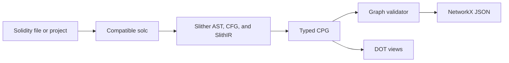

<p align="center">
  
</p>

<p align="center">
  <strong>Solidity code property graph extractor.</strong><br>
  Cross-contract control and data flow with deterministic JSON and DOT exports.
</p>

<p align="center">
  <a href="https://github.com/ImAno177/spider/actions/workflows/ci.yml"></a>
  <a href="https://docs.python.org/3/"></a>
  <a href="https://docs.soliditylang.org/"></a>
  <a href="./docs/SCHEMA.md"></a>
</p>

<p align="center">
  <a href="#quick-start">Quick start</a> ·
  <a href="#extracted-relations">Extracted relations</a> ·
  <a href="#usage">Usage</a> ·
  <a href="./docs/SCHEMA.md">Schema</a> ·
  <a href="./docs/ARCHITECTURE.md">Architecture</a>
</p>

Spider compiles a Solidity file or project with a compatible installed `solc`,
then uses Slither's AST, CFG, and SlithIR to build one typed code property graph
(CPG). The CLI validates the graph and writes deterministic NetworkX node-link
JSON. Optional DOT exports provide smaller views for inspection. An opt-in
hybrid detector can also write one JSON/DOT subgraph pair for a requested
vulnerability class or all eight registered classes.

## Quick start

Spider requires Python 3.10 or newer and a Solidity compiler managed by
`solc-select`. Graphviz is optional.

```bash
git clone https://github.com/ImAno177/spider.git
cd spider
python -m pip install .

solc-select install 0.8.20
spider path/to/dapp out/dapp.json --export calls=out/calls.dot
spider-verify out/dapp.json
```

Install more compiler versions for projects with older pragmas. Spider checks
the selected binary and records compiler and package versions in graph metadata.

<details>
<summary>Install pinned runtime dependencies explicitly</summary>

```bash
python -m pip install \
  "crytic-compile==0.3.11" \
  "slither-analyzer==0.11.5" \
  "solc-select==1.2.0"
python -m pip install --no-deps .
```

</details>

## Extracted relations



| Area | Graph content |
| --- | --- |
| Declarations | Contracts, interfaces, libraries, functions, modifiers, parameters, returns, and variables |
| Program structure | AST containment, CFG, evaluation order, dominance, post-dominance, and control dependence |
| Data flow | Reads, writes, operands, references, state access, and reaching definitions |
| Storage access | Index base/key and member base/field provenance |
| Calls | Internal, external, low-level, delegate, Ether send, and Ether transfer operations |
| Interprocedural flow | Argument/parameter and return/caller bindings, cross-contract control flow, and state effects |
| Provenance | Compiler versions, source hashes, resolved files, and compiler-provided UTF-8 byte anchors |

Cross-contract edges require a compiler-resolved source target. Unresolved
dynamic calls remain call nodes without guessed callback, proxy, or
`delegatecall` targets.

## Usage

### Files and projects

A file input includes compiler-resolved imports. A directory input compiles its
discovered `.sol` files into one Slither unit, which allows relations to cross
source and contract boundaries.

```bash
# One source file and its imports
spider contracts/Vault.sol out/vault.json

# One project graph
spider path/to/dapp out/dapp.json

# Pin an installed compiler and add import remappings
spider path/to/dapp out/dapp.json \
  --solc-version 0.8.20 \
  --solc-remap '@openzeppelin/=node_modules/@openzeppelin/'
```

Directory extraction uses Solidity Standard JSON to preserve source paths and
byte anchors. Initial source discovery skips build output, version-control
metadata, virtual environments, generated artifacts, and `node_modules`.
Dependencies in skipped directories can still be included through remappings.

### DOT exports

Repeat `--export MODE=PATH` to write several views without recompiling:

```bash
spider contracts/Vault.sol out/vault.json \
  --export calls=out/vault-calls.dot \
  --export pdg=out/vault-pdg.dot

dot -Tpng out/vault-calls.dot -o out/vault-calls.png
```

Modes: `ast`, `cfg`, `cdg`, `ddg`, `pdg`, `calls`, and `cpg`.
`edge:LABEL=PATH` exports one relation, such as
`--export edge:XCFG_CALL=out/xcfg-call.dot`.

### Vulnerability subgraphs

`--vulnerability` accepts `all`, `access_control`, `arithmetic`,
`bad_randomness`, `denial_of_service`, `front_running`, `reentrancy`,
`time_manipulation`, or `unchecked_low_level_calls`:

```bash
spider contracts/Vault.sol out/vault.json --vulnerability reentrancy
```

This keeps the validated full CPG at `out/vault.json` and writes the combined
suspicious subgraph to `out/vault.reentrancy.json` and
`out/vault.reentrancy.dot`. Use `--vulnerability-output out/review` to choose
another prefix and `--vulnerability-hops N` to change the default two-hop CPG
closure. `--vulnerability-max-nodes N` bounds each finding's retrieved context
(default 96), so a dense CPG cannot expand into an unbounded contract dump.
Even when several findings match, Spider writes one unioned pair and keeps each
finding's seed and node IDs in JSON.

A GNN localizer can hand Spider a parent-bound candidate document without
adding a PyTorch dependency to Spider:

```bash
spider contracts/Vault.sol out/vault.json \
  --vulnerability all \
  --vulnerability-localizer localizer.json
```

The document uses `spider-vulnerability-localizer/1.0`, carries the exact
parent CPG SHA-256, class confidence, scored node IDs, and provenance. Spider
rejects a mismatched parent or unanchored candidates, then applies the same
typed closure and JSON/DOT export path. The serializer used by the current
compact GNN prototype is
`kaggle_phase2_8class_helper.serialize_compact_localizer`.
When graph order contains synthetic nodes, pass the source-anchored node ID
set to that serializer so it re-ranks the full class/node matrix before the
bounded top-k hand-off.

Rules are always active and attach an evidence string. A trained model can
corroborate rules and recover model-only candidates without adding an ML
runtime dependency:

```bash
spider contracts/Vault.sol out/vault.json \
  --vulnerability all \
  --vulnerability-model model.json
```

The model is an optional, recall-oriented eight-class scorer. Its artifact is
plain JSON; runtime inference uses only Python's standard library. A model-only
candidate is emitted only when its score crosses the validation threshold and
the graph contains a class-specific local anchor (for example, a low-level call
for unchecked-call detection or a timestamp builtin for time manipulation).
Rule findings remain active even without the model. These are suspicious
candidates for review, not proof that an exploit exists.

Train a model from compact graph JSONL shards and partial-label detection
records with the optional ML dependency:

```bash
python -m pip install '.[ml]'
spider-train-vulnerability \
  --graphs path/to/graph-shards \
  --labels path/to/detection_records.jsonl \
  --output out/vulnerability-model
```

The output directory contains `model.json`, `training-report.json`,
`manifest.json`, and `checksums.sha256`.

### Batch extraction

`spider-batch` processes each `.sol` file in an isolated subprocess. One failed
input does not stop the corpus run, and the output directory must be empty.

```bash
spider-batch dataset/ out/corpus --timeout 30
```

Results are written to `graphs/`, `manifest.jsonl`, and `summary.json`. Failed
inputs remain explicit manifest records.

## Python API

```python
from spider import extract
from spider.verify import validate

graph = extract(
    "contracts/Vault.sol",
    solc_remaps=["@openzeppelin/=vendor/openzeppelin/"],
)

errors = validate(graph)
if errors:
    raise RuntimeError("\n".join(errors))

from spider import detect_vulnerabilities
report = detect_vulnerabilities(graph, "reentrancy")
```

`extract` accepts a file or directory and returns a NetworkX node-link
dictionary. Python callers choose when to validate and serialize it.

## Graph output

Nodes have canonical IDs, contiguous canonical order, typed labels, and source
anchors where Slither supplies them. Graph metadata records the node/edge
vocabularies, source manifest, SHA-256 hashes, compiler fingerprint, and package
versions.

See the [graph schema](docs/SCHEMA.md) for fields, relation semantics, and
compatibility rules. The [architecture guide](docs/ARCHITECTURE.md) explains
compilation, extraction, canonicalization, and validation.

## Limitations

- Inline assembly and Yul are opaque nodes; Spider does not expand their
  internal operations.
- The analysis is not path-sensitive and does not perform symbolic execution.
- Storage-slot aliases are not modeled.
- Modifier and state-effect summaries are context-insensitive.
- Runtime callbacks, proxies, and dynamic targets are not inferred without a
  compiler-resolved source target.
- Vulnerability rules are deliberately recall-oriented and are neither
  path-sensitive nor exploit proofs. Model-only candidates are locally gated
  feature attribution, not line-level supervision.
- Compiler, parser, and SlithIR failures stop extraction for the affected input.

## Development

```bash
python -m pip install -e '.[dev]'
python -m pytest tests -q --durations=10
python -m ruff check .
python -m compileall -q spider tests scripts
python -m pip wheel . --no-deps --wheel-dir out/wheels
```

Contribution rules are in [CONTRIBUTING.md](CONTRIBUTING.md). Security reports
follow [SECURITY.md](SECURITY.md). Planned work is tracked in the
[roadmap](docs/ROADMAP.md).

## License

No project license has been selected. The source is publicly viewable, but no
additional permissions are granted unless a license is added.
