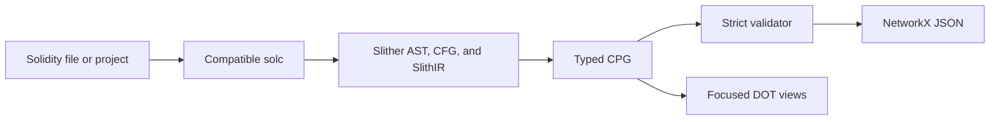

<p align="center">
  
</p>

<p align="center">
  <strong>Compiler-backed Solidity code property graphs.</strong><br>
  Whole-project extraction, cross-contract flow, deterministic output, and strict validation.
</p>

<p align="center">
  <a href="https://github.com/ImAno177/spider/actions/workflows/ci.yml"></a>
  <a href="https://docs.python.org/3/"></a>
  <a href="https://docs.soliditylang.org/"></a>
  <a href="./docs/SCHEMA.md"></a>
</p>

<p align="center">
  <a href="#quick-start">Quick start</a> ·
  <a href="#graph-model">Graph model</a> ·
  <a href="#usage">Usage</a> ·
  <a href="./docs/SCHEMA.md">Schema</a> ·
  <a href="./docs/ARCHITECTURE.md">Architecture</a>
</p>

Spider converts a Solidity source file or project directory into one typed code
property graph (CPG). It selects an installed `solc` version compatible with the
project pragmas, builds one Slither compilation unit, derives control- and
data-flow relations from its AST, CFG, and SlithIR, then validates the graph
before writing NetworkX node-link JSON.

The current graph format is `spider-cpg/1.0`. Spider extracts program structure;
it is not a vulnerability scanner, symbolic executor, or runtime target
resolver.

<p align="center"><code>Solidity project → solc + Slither → validated CPG JSON + focused DOT views</code></p>

| Whole-project | Evidence-first | Reproducible |
| --- | --- | --- |
| One graph across source files, contracts, libraries, and resolved imports | Cross-contract relations are emitted only for compiler-resolved targets | Canonical ordering, source hashes, compiler fingerprints, and strict validation |

## Quick start

Spider requires Python 3.10 or newer and at least one Solidity compiler managed
through `solc-select`. Graphviz is optional and is needed only to render DOT
files as images.

```bash
git clone https://github.com/ImAno177/spider.git
cd spider
python -m pip install .

solc-select install 0.8.20
spider path/to/dapp out/dapp.json --export calls=out/calls.dot
spider-verify out/dapp.json
```

Spider selects an installed compiler compatible with every non-empty pragma in
the input. Install additional versions when processing older projects; the test
fixtures exercise `0.4.25`, `0.8.11`, and `0.8.20`.

<details>
<summary>Install pinned runtime dependencies explicitly</summary>

```bash
python -m pip install \
  "crytic-compile==0.3.11" \
  "slither-analyzer==0.11.5" \
  "solc-select==1.2.0"
python -m pip install --no-deps .
```

</details>

Spider fingerprints each selected compiler binary, checks its reported version,
and stores the compiler and package versions in graph metadata.

## Graph model

The `spider` CLI writes one validated JSON graph. `spider-batch` writes one graph
per successful corpus item plus a provenance manifest. For a source file, the
graph includes its compiler-resolved imports. For a project directory, Spider
compiles all discovered `.sol` sources together so calls, arguments, returns,
control flow, and state effects can cross file and contract boundaries. Optional
DOT exports provide smaller views of the same graph.



| Area | Extracted information |
| --- | --- |
| Declarations | Contracts, interfaces, libraries, functions, modifiers, parameters, returns, local variables, and state variables |
| Program structure | AST containment, CFG, SlithIR evaluation order, dominance, post-dominance, and control dependence |
| Data flow | Reads, writes, state access, operands, references, and reaching definitions |
| Storage access | Index base/key and member base/field provenance |
| Calls | Internal, external, low-level, delegate, Ether send, and Ether transfer operations |
| Interprocedural flow | Argument-to-parameter, return-to-caller, source-resolved cross-function and cross-contract control flow, and direct/transitive state effects |
| Provenance | Compiler versions, source hashes, resolved source files, and UTF-8 byte anchors when supplied by the compiler |

Interprocedural edges are added only for source targets resolved by the
compiler. Dynamic addresses, proxy implementations, callbacks, and unresolved
`delegatecall` targets are retained as calls but are not linked to guessed
implementations.

## Usage

### Source file

Extract one entry source and its compiler-resolved imports:

```bash
spider contracts/Vault.sol out/vault.json
spider-verify out/vault.json
```

The `spider` command validates the graph before it writes the JSON file.
`spider-verify` is available for validating a graph again after copying,
transforming, or loading it from another process.

### Whole-project extraction

Pass a directory to compile its Solidity sources into one graph:

```bash
spider path/to/dapp out/dapp.json \
  --export calls=out/dapp-calls.dot
```

Spider recursively discovers `.sol` files, selects a compiler satisfying all
non-empty project pragmas, and uses Solidity Standard JSON so original files and
byte anchors remain intact. Generated/build directories, virtual environments,
version-control metadata, and `node_modules` are not treated as project entry
sources. Add dependency trees through import remappings when needed:

```bash
spider path/to/dapp out/dapp.json \
  --solc-remap '@openzeppelin/=node_modules/@openzeppelin/'
```

Use `spider SOURCE_DIR OUTPUT.json` when one folder is one dapp. Use
`spider-batch DATASET OUTPUT_DIR` when a corpus should produce one graph and one
manifest record per `.sol` file.

### DOT views

Repeat `--export MODE=PATH` to produce more than one view during the same
extraction:

```bash
spider contracts/Vault.sol out/vault.json \
  --export calls=out/vault-calls.dot \
  --export pdg=out/vault-pdg.dot

dot -Tpng out/vault-calls.dot -o out/vault-calls.png
```

Supported modes are `ast`, `cfg`, `cdg`, `ddg`, `pdg`, `calls`, and `cpg`.
Use `edge:LABEL=PATH` to export one exact edge label, for example
`--export edge:XCFG_CALL=out/xcfg-call.dot`.

### Compiler selection and import remappings

By default, Spider chooses an installed compiler compatible with the source
pragma or every pragma in a project directory. Pin one installed version with
`--solc-version`:

```bash
spider contracts/Vault.sol out/vault.json --solc-version 0.8.20
```

Repeat `--solc-remap` when a project uses import remappings:

```bash
spider contracts/Vault.sol out/vault.json \
  --solc-remap '@openzeppelin/=vendor/openzeppelin/' \
  --solc-remap '@chainlink/=vendor/chainlink/'
```

The command interfaces are:

```text
spider SOURCE OUTPUT
       [--export MODE=PATH]
       [--solc-remap REMAPPING]
       [--solc-version VERSION]

spider-verify GRAPH
spider-batch DATASET OUTPUT
             [--timeout SECONDS]
             [--solc-remap REMAPPING]
             [--solc-version VERSION]
```

## Python API

```python
from spider import extract
from spider.verify import validate

graph = extract(
    "contracts/Vault.sol",
    solc_remaps=["@openzeppelin/=vendor/openzeppelin/"],
)

errors = validate(graph)
if errors:
    raise RuntimeError("\n".join(errors))
```

`extract` accepts either a source file or directory and returns a Python
dictionary in NetworkX node-link form. It does not write files or call
`validate`; callers using the Python API decide when to validate and serialize
the result.

## Batch extraction

`spider-batch` recursively processes every `.sol` file under a dataset root.
The output directory must be empty. Each source runs in a separate subprocess
so one compiler or Slither failure does not stop the remaining inputs.

```bash
spider-batch dataset/ out/corpus --timeout 30
```

The command writes graphs under `graphs/`, one record per input to
`manifest.jsonl`, and aggregate counts and vocabularies to `summary.json`.
Failures remain explicit manifest records.

## Graph contract

Nodes use canonical IDs and a contiguous canonical `order`. Edges and nodes
carry typed `label` values. `graph.node_types` and `graph.edge_types` list the
labels present in that graph, while `graph.source_files` records the source-unit
manifest and SHA-256 hashes.

The full field definitions, relation semantics, and compatibility rules are in
[docs/SCHEMA.md](docs/SCHEMA.md). The extraction stages and module boundaries
are in [docs/ARCHITECTURE.md](docs/ARCHITECTURE.md).

## Development checks

Install the development dependencies, then run the repository gates:

```bash
python -m pip install -e '.[dev]'
python -m pytest tests -q --durations=10
python -m ruff check .
python -m compileall -q spider tests scripts
python -m pip wheel . --no-deps --wheel-dir out/wheels
```

`pyproject.toml` also sets `testpaths = ["tests"]`; CI names the folder explicitly
and prints the ten slowest tests. The workflow is intentionally triggered only
by changes under `spider/**`, but once triggered it runs the complete test suite.
The suite covers source anchors, control and evaluation order, modifier overlays,
calls and returns, storage access, argument producers, state effects,
inline-assembly coverage, and verifier rejection of corrupted graphs.

## Current limitations

- Inline assembly and Yul are reported as opaque; their internal operations are
  not expanded into subgraphs.
- The analysis is not path-sensitive and does not perform symbolic execution.
- Storage-slot aliases are not modeled.
- Modifier and state-effect summaries are context-insensitive.
- Runtime callbacks, proxies, and dynamic call targets are not inferred without
  compiler-resolved source evidence.
- Compiler, parser, and SlithIR construction failures are reported as
  extraction errors rather than partial success.

## Documentation

- [Architecture](docs/ARCHITECTURE.md)
- [Graph schema](docs/SCHEMA.md)
- [Contributing](CONTRIBUTING.md)
- [Security policy](SECURITY.md)
- [Roadmap](docs/ROADMAP.md)

## License

No project license has been selected. Unless a license is added, the source is
publicly viewable but no additional permissions are granted.
